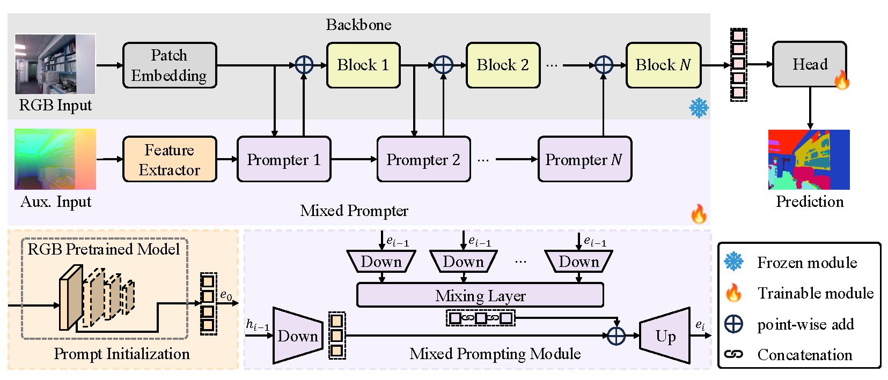
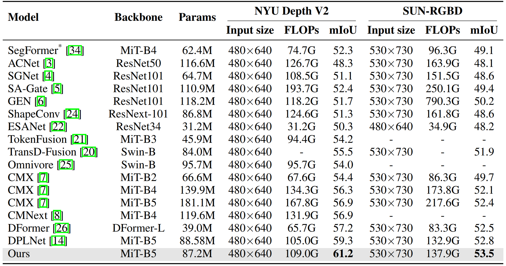
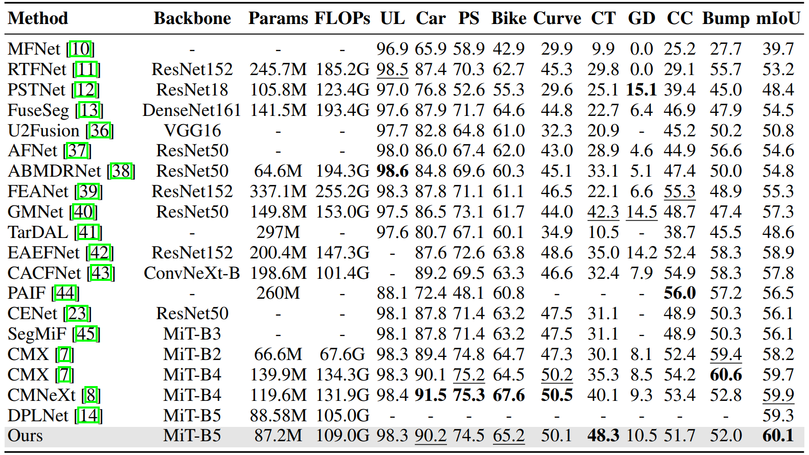
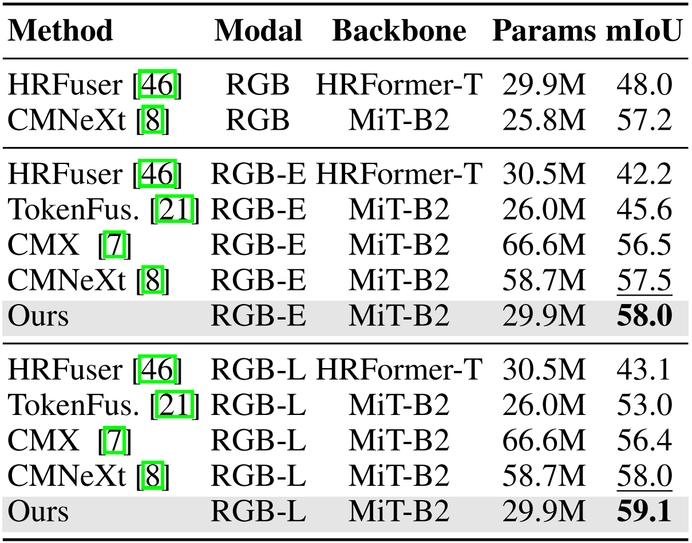
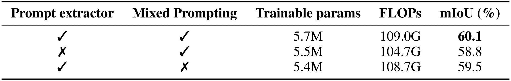
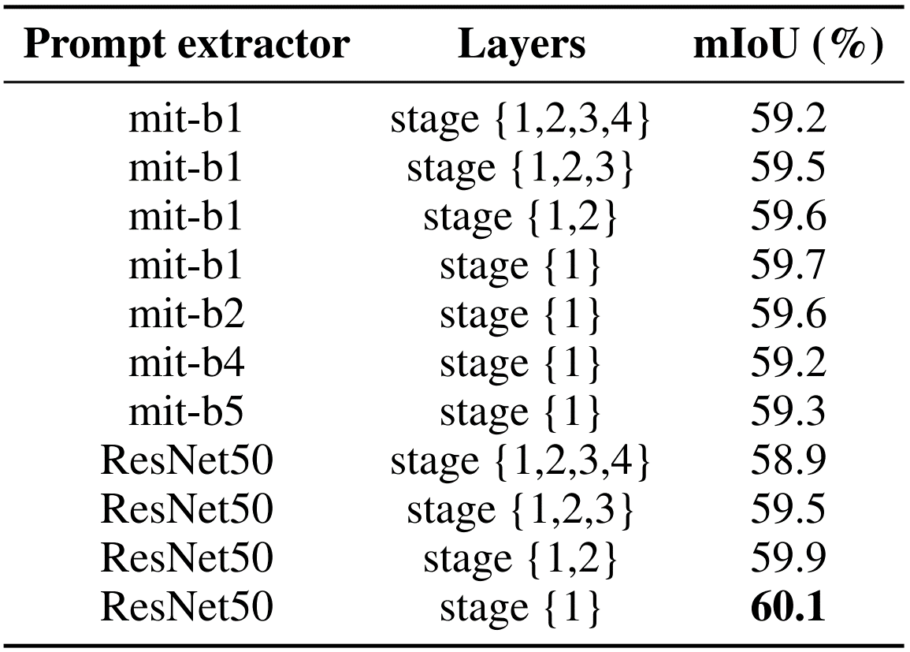
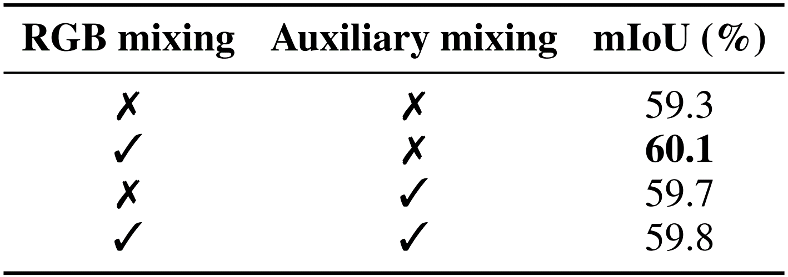
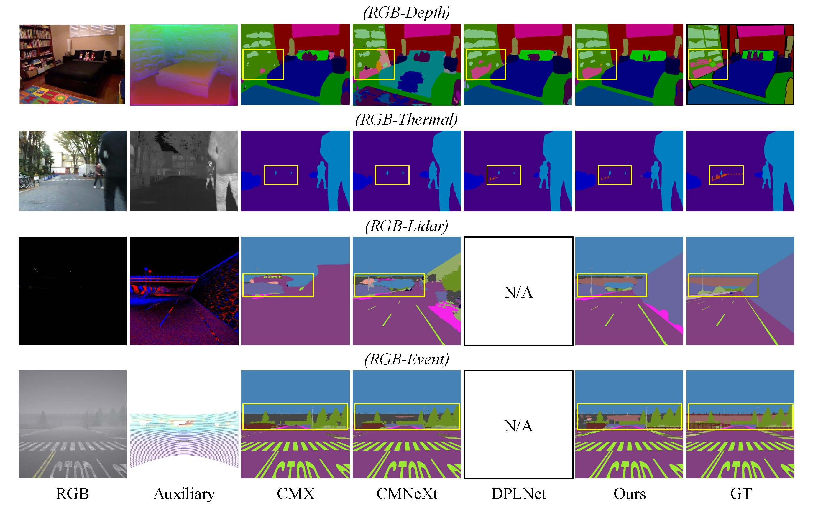

# MixPrompt: Efficient Mixed Prompting for Multimodal Semantic Segmentation

<!-- This is the official implementation of our paper  **[MixPrompt: Efficient Mixed Prompting forMultimodal Semantic Segmentation](https://dl.acm.org/doi/pdf/10.1145/3664647.3681253))**. -->
This is the official implementation of our paper  **MixPrompt: Efficient Mixed Prompting forMultimodal Semantic Segmentation**.

Authors: Zhiwei Hao, Zhongyu Xiao, Jianyuan Guo, Li Shen, Yong Luo, Han Hu, Dan Zeng


## Introduction
We present a prompt based multimodal semantic segmentation on the basis of pertained single-modality RGB model.

## Framework


## Data
### NYU Depth V2 Datasets (RGB-Depth)
You could download the official NYU Depth V2 data [here](https://cs.nyu.edu/~silberman/datasets/nyu_depth_v2.html). After downloading the official data, you should modify them according to the structure of directories we provide. 

### SUN-RGBD Datasets (RGB-Depth)
You can download the dataset from the official SUNRGBD [website](https://rgbd.cs.princeton.edu/) and preprocess it according to the requirements specified on the website.

For RGB-Depth semantic segmentation, the generation of HHA maps from Depth maps can refer to https://github.com/charlesCXK/Depth2HHA-python.

### MFNet Datasets (RGB-Thermal)
You can download the dataset from the official MFNet [website](https://github.com/haqishen/MFNet-pytorch)

### DELIVER Datasets (RGB-Depth-Event-LiDAR)
You can download the dataset from the official DELIVER [website](https://github.com/jamycheung/DELIVER)

## Installation
1. Clone this repo.
```
$ git clone https://github.com/xiaoshideta/MixPrompt.git
$ cd mixprompt-main
```

2. Install all dependencies.
```
$ conda create -n mixprompt python=3.8.11
$ pip install -r requirements.txt
$ conda activate mixprompt
```


## Directory Tree
Your directory tree should look like this:
```shell
|-- <configs>
|-- <semseg>
    |-- <datasets>
    |-- <models>
    |-- <utils>
|-- <pretrained>
    |-- <pre>
    |-- <segformer>
|-- <dataset>
    |-- <NYUDepthv2>
        |-- <RGBFolder>
        |-- <HHAFolder>
        |-- <LabelFolder>
        |-- train.txt
        |-- test.txt
```

## Training and Inference
### Pretrain weights:

Download the pretrained segformer [here](https://drive.google.com/file/d/1mPrJUOiqAjX-nJEFLLyQGk6QFyMr0k-Z/view?usp=drive_link).


### Training
```shell
$ bash train.sh
```

```shell
$ CUDA_VISIBLE_DEVICES=0,1,2,3 python -m torch.distributed.launch --master_port=25035 --nproc_per_node=4 --use_env train_mm.py --cfg configs/nyu.yaml --wandb 0
```

### Inference
```shell
$ bash val.sh
```
```shell
CUDA_VISIBLE_DEVICES=5 python val_mm.py --cfg configs/nyu.yaml
```

## Result









<!-- ## Citation
If you find this work useful for your research, please cite our paper:
```
@inproceedings{hao2024primkd,
  title={PrimKD: Primary Modality Guided Multimodal Fusion for RGB-D Semantic Segmentation},
  author={Hao, Zhiwei and Xiao, Zhongyu and Luo, Yong and Guo, Jianyuan and Wang, Jing and Shen, Li and Hu, Han},
  booktitle={Proceedings of the 32nd ACM International Conference on Multimedia},
  pages={1943--1951},
  year={2024}
}
``` -->

## Acknowledgement

Part of our code is based on [CMNeXt](https://github.com/jamycheung/DELIVER) and [PrimKD](https://github.com/xiaoshideta/PrimKD),  thanks for their excellent work!

